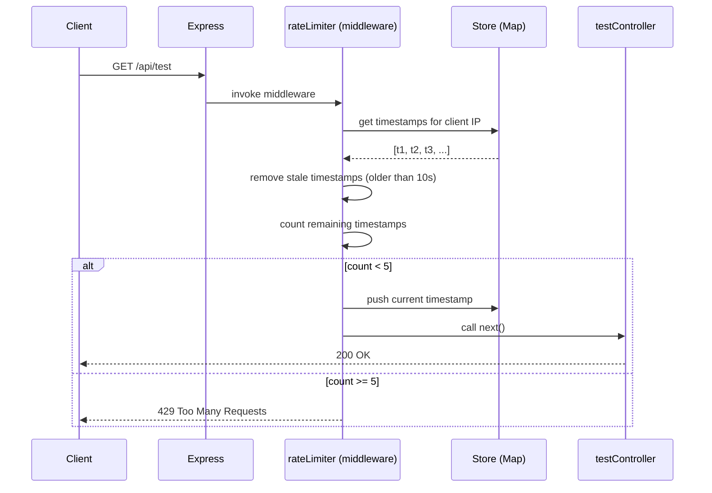

# Design Document: Rate Limiter

## Overview

This project is a beginner-friendly Node.js + Express backend that demonstrates how rate limiting works internally using the **Sliding Window** algorithm. The goal is not just a working implementation but a deeply educational one — every non-obvious decision is explained in comments so a beginner can read the code and understand the "why", not just the "what".

The system limits each IP address to **5 requests per 10 seconds**. When the limit is exceeded, it returns HTTP 429 with a helpful message. All state is stored in-memory using a JavaScript `Map`.

---

## Architecture

```
rate-limiter/
├── server.js           ← Starts the HTTP server on a port
├── app.js              ← Creates the Express app, registers routes and middleware
├── middleware/
│   └── rateLimiter.js  ← Core sliding window logic lives here
├── routes/
│   └── api.js          ← Defines /api/test and / routes
├── controllers/
│   └── testController.js ← Handler for /api/test
├── utils/
│   └── store.js        ← The in-memory Map store
└── README.md           ← Setup, testing, and algorithm explanations
```

### Request Flow



---

## Components and Interfaces

### 1. `utils/store.js` — The In-Memory Store

Exports a single shared `Map` instance used across the entire application.

```
Map<string, number[]>
  key   → Client IP address (e.g. "192.168.1.1")
  value → Array of request timestamps in milliseconds (e.g. [1700000001000, 1700000003500])
```

**Why `Map` and not a plain object `{}`?**
- `Map` has O(1) average-case get/set/delete
- `Map` keys can be any type (useful if we later switch from IP strings to objects)
- `Map` has a built-in `.size` property and is iterable
- `Map` does not inherit prototype properties (no accidental key collisions like `"constructor"`)

### 2. `middleware/rateLimiter.js` — The Core Algorithm

Signature: `rateLimiter(req, res, next)`

**Sliding Window Algorithm Steps:**

```
1. Get current time in ms:  now = Date.now()
2. Extract client IP from req
3. Get (or create) the timestamp array for this IP from the Store
4. Remove all timestamps where: timestamp < (now - WINDOW_SIZE_MS)
   → These are "stale" — they happened more than 10 seconds ago
5. Count remaining timestamps → this is how many requests in the current window
6. If count < MAX_REQUESTS (5):
     - Push `now` into the array (record this request)
     - Set rate limit headers
     - Call next()
   Else:
     - Return 429 with JSON error body
     - Set Retry-After header
```

**Time Complexity:**
- Per request: O(k) where k = number of timestamps currently in the window
- In the worst case (burst of 5 requests), k = 5, so effectively O(1) in practice
- Space: O(n * k) where n = unique IPs and k = max requests per window = O(n * 5) = O(n)

**Constants (configurable):**
```js
const WINDOW_SIZE_MS = 10 * 1000  // 10 seconds
const MAX_REQUESTS   = 5
```

### 3. `routes/api.js` — Route Definitions

| Method | Path        | Middleware    | Handler           |
|--------|-------------|---------------|-------------------|
| GET    | /           | none          | inline health check |
| GET    | /api/test   | rateLimiter   | testController.test |

### 4. `controllers/testController.js` — Route Handler

Handles `GET /api/test`. Returns:
```json
{
  "success": true,
  "message": "Request successful!",
  "yourIP": "::1",
  "requestsRemaining": 3
}
```

### 5. `app.js` — Express App Setup

- Creates Express app
- Registers `express.json()` middleware
- Mounts routes

### 6. `server.js` — HTTP Server Entry Point

- Imports `app`
- Listens on `PORT` (default 3000)

---

## Data Models

### Request Timestamp Log (per IP)

```
{
  "::1":            [1700000001000, 1700000003500, 1700000007200],
  "192.168.1.100":  [1700000009000]
}
```

Stored as `Map<string, number[]>` in `utils/store.js`.

### HTTP 429 Response Body

```json
{
  "success": false,
  "error": "Too Many Requests",
  "message": "You have exceeded the limit of 5 requests per 10 seconds. Please wait before retrying.",
  "retryAfterMs": 4321
}
```

### HTTP 200 Response Body (`/api/test`)

```json
{
  "success": true,
  "message": "Request successful!",
  "yourIP": "::1",
  "requestsRemaining": 2
}
```

### Response Headers (set on every `/api/test` response)

| Header                | Value                          | Meaning                              |
|-----------------------|--------------------------------|--------------------------------------|
| `X-RateLimit-Limit`   | `5`                            | Max requests allowed per window      |
| `X-RateLimit-Remaining` | `0`–`5`                      | Requests left in current window      |
| `Retry-After`         | seconds until window resets    | Only set on 429 responses            |

---

## Correctness Properties

A property is a characteristic or behavior that should hold true across all valid executions of a system — essentially, a formal statement about what the system should do. Properties serve as the bridge between human-readable specifications and machine-verifiable correctness guarantees.

Property 1: Sliding window only counts recent timestamps
*For any* client IP and any sequence of request timestamps, after cleanup the Store SHALL only contain timestamps within the last 10,000 ms relative to the current time.
**Validates: Requirements 3.2, 3.3**

Property 2: Request count never exceeds the limit
*For any* client IP, the number of timestamps stored in the window after a request is processed SHALL never exceed MAX_REQUESTS (5).
**Validates: Requirements 4.1, 4.3**

Property 3: Allowed requests increment the store
*For any* client IP with fewer than 5 timestamps in the current window, after a successful (non-429) request the timestamp array length SHALL increase by exactly 1.
**Validates: Requirements 4.2, 3.1**

Property 4: Rejected requests do not mutate the store
*For any* client IP that has already reached the limit (5 timestamps in window), a rejected request SHALL NOT add any new timestamp to the store.
**Validates: Requirements 4.3**

Property 5: Stale timestamp removal is idempotent
*For any* client IP, running the stale-timestamp cleanup function multiple times in a row without new requests SHALL produce the same result as running it once.
**Validates: Requirements 3.2**

Property 6: X-RateLimit-Remaining is consistent with store
*For any* allowed request, the value of `X-RateLimit-Remaining` header SHALL equal `MAX_REQUESTS - (count of timestamps in window after the request is recorded)`.
**Validates: Requirements 4.5**

Property 7: Whitespace/empty IP falls back to "unknown"
*For any* request where the IP cannot be determined, THE Rate_Limiter SHALL use the key `"unknown"` and still apply rate limiting correctly.
**Validates: Requirements 5.2**

---

## Error Handling

| Scenario | Behavior |
|---|---|
| Store lookup throws | Catch error, log to console, call `next()` — never block traffic on internal error |
| IP is undefined/null | Fall back to `"unknown"` as the store key |
| Server restart | In-memory Map is cleared — all windows reset (by design, documented in README) |
| Concurrent requests from same IP | Node.js single-threaded event loop serializes all callbacks — no race conditions possible |

---

## Testing Strategy

### Unit Tests (specific examples and edge cases)

Use **Jest** as the test runner.

- Test that a new IP starts with an empty timestamp array
- Test that after 5 requests, the 6th returns 429
- Test that after 10 seconds, the window resets and requests are allowed again
- Test that the `"unknown"` fallback is used when IP is missing
- Test that stale timestamps are correctly removed

### Property-Based Tests

Use **fast-check** as the property-based testing library. Each property test runs a minimum of **100 iterations**.

Each test is tagged with:
`// Feature: rate-limiter, Property N: <property text>`

- **Property 1**: For any array of timestamps, after cleanup no timestamp older than `now - 10000` remains
  - Generate: random arrays of timestamps spanning a 30-second range
  - Assert: all remaining timestamps are within the window

- **Property 2**: For any sequence of requests, the store never holds more than 5 timestamps per IP
  - Generate: random number of requests (1–20) from the same IP
  - Assert: `store.get(ip).length <= 5` after each request

- **Property 3**: For any allowed request (count < 5), the array grows by exactly 1
  - Generate: random IPs with 0–4 existing timestamps
  - Assert: array length increases by 1 after a successful request

- **Property 4**: For any rejected request (count >= 5), the array does not grow
  - Generate: IPs with exactly 5 timestamps in window
  - Assert: array length unchanged after rejected request

- **Property 5**: Stale cleanup is idempotent
  - Generate: random timestamp arrays with a mix of old and recent entries
  - Assert: running cleanup twice produces same result as once

- **Property 6**: X-RateLimit-Remaining header matches store state
  - Generate: random IPs with 0–4 existing timestamps
  - Assert: header value equals `5 - newCount`

**Property Test Configuration:**
- Library: `fast-check`
- Minimum iterations: 100 per property (`numRuns: 100`)
- Each test file references the design property number in a comment

### Integration Tests

- `GET /api/test` returns 200 for first 5 requests from same IP
- `GET /api/test` returns 429 on the 6th request
- `GET /` returns 200 with no rate limiting applied
- Response headers (`X-RateLimit-Limit`, `X-RateLimit-Remaining`) are present and correct
